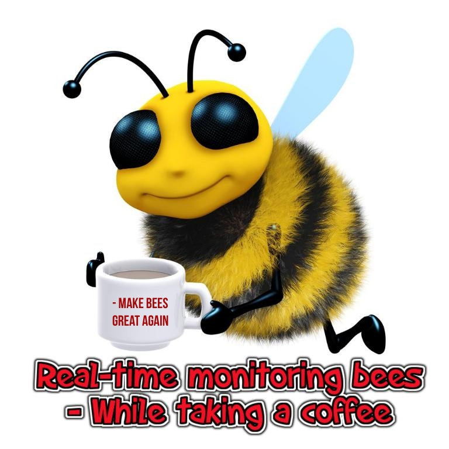
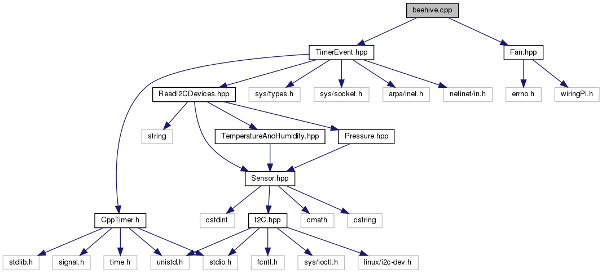

# Real-Time Beehive Monitoring

We want to help beekeepers to keep an eye on their bees. By giving them insight on critical measurements we can monitor different events such as too low temperature, too high moisture, sufficient weight to harvest honey, as well as giving an estimate of how many bees went out of the beehive harvesting.

This project aims to set up a weather station with sensors and a fan to control the atmosphere inside the hive. The sensors output can be visualized through a website that can be hosted either locally on the Raspberry Pi, or hosted on the cloud (example [here](https://beehiveproject.herokuapp.com/)).

This project is done in partnership with the [Glasgow University Beekeeping Society](https://www.facebook.com/GUBeekeepingSociety/)

It was a success ! The Pi was able to make measurement of the ambiant temperature, pressure and humidity, as well as start the fan when the humidity got too high.

The website was displaying the value every 2 seconds while the fan was starting in as soon as the sensors triggered the alarm through a processor interrupt. Note, however, that the sensor provide data at more than 50Hz but it was decided the cap it to 2 second to avoid high traffic on the server (if hosted on the cloud).

## Table of contents
* [Setup](#setup)
* [General info](#general-info)
* [Technologies](#technologies)
* [Authors](#authors)
* [Images](#images)
* [Social media](#social-media)
## Setup

Instructions for installation can be found on the [installation wiki](https://github.com/MaysaraHolmes/beehive/wiki/Installation).

## General info
The code is simplified divided into three. Client, server and Fan.  
* The client is inteerupt by a timer every x millisecond reading the sensor data and sending it via udp to the server.  
* The server publish the data to our [example webpage](https://beehiveproject.herokuapp.com/) and saves the data to a database.
Additionally the server will send an email to registrered email-addresses everytime the humidity inside the beehive is too high.  
The website can be hosted either on a locally run server on the Raspberry Pi or hosted on a cloud based server. 
* The Fan is run depending on only one input pin. This pin is connected to the alarm on the humidity sensor inside the fan and will toggle instantaneously if the humidity goes above 80% humidity and off if it goes under 75% humidity. If the alarm pin toggles, it triggers an thread which will start or stop the fan depending if the pin goes high or low respectively.  
By this architecture the fan will be triggered even if the main code or the i2c bus fails to read the sensors. Making the code responsive and reliable. On the other hand if the alarm pin is disconnected you will still get an email/display on the webpage that the humidity inside the beehive is too high.
 
 
This projects architecture diagram:

Dependency graph for the C++ code:

The doxygen generated c++ documentation can be found here: [beehive_code_documentation](https://github.com/MaysaraHolmes/beehive/blob/master/documentation/beehive_code_documentation.pdf)

## Technologies

Project is created with:
* Raspberry pi 3.0
* Sensors
	* ADC101C021 ADC
	* HIH6131 Temperatur & Humidity x2
	* MPL115A2 Barometer
	* P82B96 I2C Shifter
* Node Js/express Js server
* MySQL database.
* [WiringPi](http://wiringpi.com/reference/core-functions/) 
* [CppTimer.h](https://github.com/berndporr/cppTimer) 

## Authors

* **Remy Chatel, 2411062**  - [Github](https://github.com/RemyChatel) (Main responsibility: Hardware)

* **Maysara Alhindi, 2417665**  - [Github](https://github.com/MaysaraHolmes) (Main responsibility: Nodejs Server side and Front-end)

* **Trine Ødegård Olsen, 2420036**  - [Github](https://github.com/trineoo) (Main responsibility: C++ code)

## Images

The beehives in the backyard in the university of Glasgow

	

	 
Picture of the hardware, without the fan, soldered

	

## Social media
* [Hackster](https://www.hackster.io/maysara-alhindi/real-time-beehive-monitoring-glasgow-university-5a986c?fbclid=IwAR0-vXvfKS6yhzB5cdmx6wDfkbD9QhEtdo_F_e8NovsFujnpzO1nPfwy76o)
* [Hackaday](https://hackaday.io/project/164984-real-time-beehive-monitoring-glasgow-university)
* [Glasgow University Beekeeping Society](https://www.facebook.com/GUBeekeepingSociety/)
